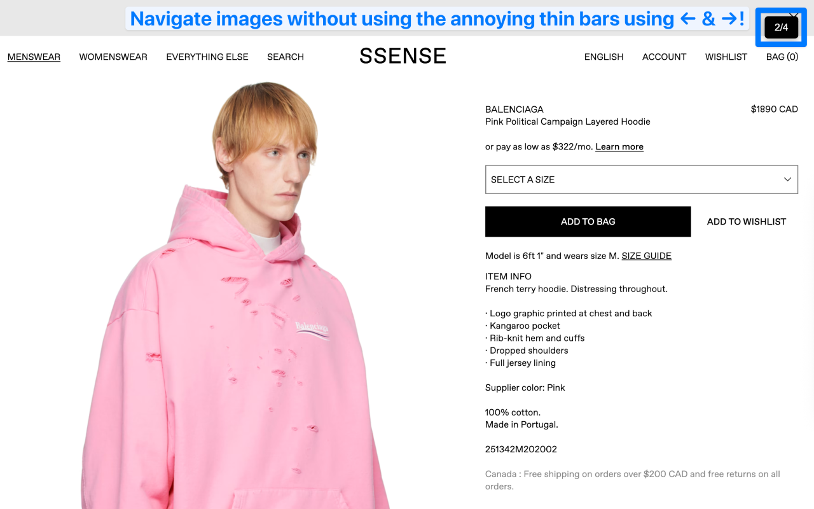
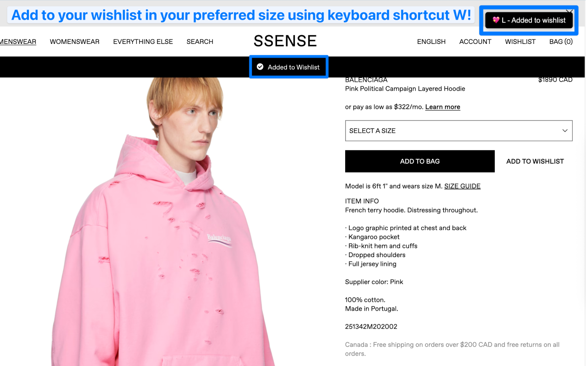
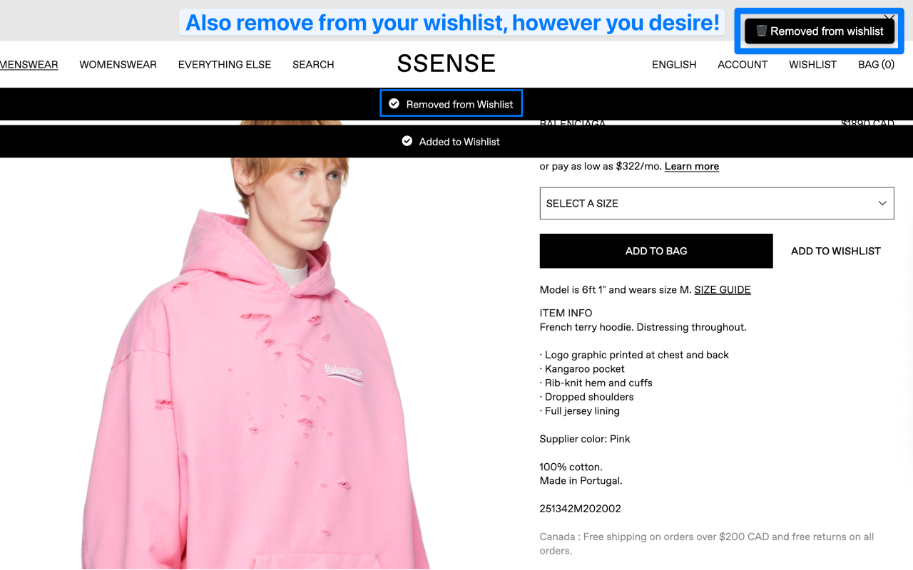
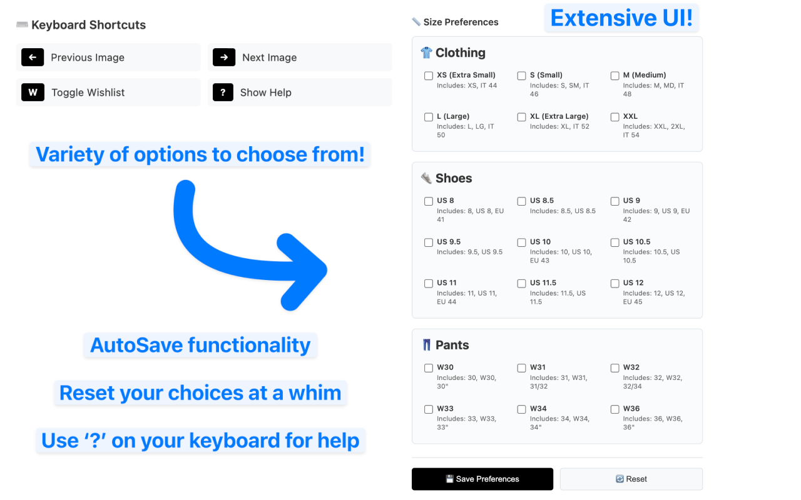

# SSENSE Navigator Chrome Extension

🛍️ **Navigate SSENSE like a pro with keyboard shortcuts, smart size selection, and instant wishlist management.**

[](https://chrome.google.com/webstore/detail/YOUR_EXTENSION_ID)
[](https://chrome.google.com/webstore/detail/YOUR_EXTENSION_ID)
[](LICENSE)
[](https://github.com/yourusername/ssense-navigator)

## ✨ Key Features

### ⌨️ **Keyboard Navigation**
- **Arrow Key Control**: 
  - `←` Previous product image
  - `→` Next product image
- **Quick Actions**:
  - `W` Toggle wishlist status
  - `?` Show help popup

### 🧠 **Smart Size Selection**
- **Automatic Detection**:
  - 👕 Clothing: M = Medium = IT48
  - 👟 Shoes: EU 42 = US 10.5
  - 👖 Pants: 32 = W32 = 32/34
- **Fallback System**: Selects first available size if preferences unavailable

### ⚙️ **Customizable Preferences**
- **Popup Interface**:
  - 👕 XS/S/M/L/XL clothing sizes
  - 👟 US 8-15 / EU/IT 39-48 shoe sizes
  - 👖 Waist 28-40 pants sizes
- **Cross-Device Sync**: Chrome storage keeps settings consistent

### 💡 **Real-Time Feedback**
- **Clean Notifications**:
  - Black theme matching SSENSE aesthetic
  - Position indicators (e.g., "Image 3/5")
  - Error messages for missing elements

### 🛠️ **Technical Excellence**
- **Vue.js Integration**: Full compatibility with SSENSE's framework
- **Dynamic DOM Handling**: Automatic element detection
- **Lightweight**: Zero performance impact on browsing

## 🚀 User Benefits
- **Consistent Experience**: Unified sizes across all products
- **Seamless Integration**: Works automatically on all SSENSE product pages

## 🎮 Keyboard Shortcuts

| Key | Action | Description |
|-----|--------|-------------|
| `←` | Previous Image | Navigate to the previous product image |
| `→` | Next Image | Navigate to the next product image |
| `W` | Toggle Wishlist | Add to wishlist (with auto size selection) or remove |
| `?` | Show Help | Display available keyboard shortcuts |

## 📸 Images & Videos

### Navigation in Action & Wishlist Management




### Size Selection Demo
https://github.com/user-attachments/assets/7d56aa12-a0a3-4c42-a8da-7f39f741bf02

### Extensive UI


## 🚀 Installation

### From Chrome Web Store (Recommended)
1. Visit the [Chrome Web Store page](https://chrome.google.com/webstore/detail/YOUR_EXTENSION_ID)
2. Click "Add to Chrome"
3. Confirm installation
4. Navigate to any SSENSE product page and start using the extension!

### Contributing

We welcome contributions! Here's how to get started:

1. **Fork the Repository**
2. **Create a Feature Branch**:
   ```bash
   git checkout -b feature/amazing-feature
   ```
3. **Make Your Changes**:
   - Follow the existing code style
   - Test thoroughly on SSENSE
   - Add documentation for new features
4. **Commit Your Changes**:
   ```bash
   git commit -m "Add amazing feature"
   ```
5. **Push to Your Fork**:
   ```bash
   git push origin feature/amazing-feature
   ```
6. **Open a Pull Request**

### Development Guidelines

- **Code Style**: Use consistent JavaScript formatting
- **Testing**: Test on multiple SSENSE product types (shoes, clothing, accessories)
- **Performance**: Keep the extension lightweight and fast
- **Compatibility**: Ensure compatibility with SSENSE's frequent UI updates

## 🔧 Technical Details

### Architecture
- **Manifest V3**: Uses the latest Chrome extension standard for better security and performance
- **Content Script**: Runs only on SSENSE product pages for optimal performance
- **Vue.js Integration**: Works seamlessly with SSENSE's Vue.js framework
- **DOM Events**: Properly dispatches events to integrate with SSENSE's reactivity system

### Browser Compatibility
- ✅ **Chrome**: Fully supported (primary target)
- ✅ **Arc**: Supported
- ✅ **Edge**: Supported (Chromium-based)
- ✅ **Brave**: Supported
- ✅ **Opera**: Supported
- ❓ **Firefox**: Not tested (would require WebExtensions port)

### Privacy & Security
- **No Data Collection**: Extension doesn't collect or transmit any user data
- **Minimal Permissions**: Only requests access to SSENSE domains
- **Local Processing**: All logic runs locally in your browser
- **Open Source**: Complete transparency with public source code

## 🎯 Roadmap

### v1.1 - Enhanced Features
- [ ] Shortcut to ADD TO BAG
- [ ] Shortcut for clicking on the images tab

### v1.2 - Advanced Navigation  
- [ ] Zoom functionality with keyboard
- [ ] Product comparison shortcuts

### v1.3 - User Experience
- [ ] Dark/light mode toggle
- [ ] Custom notification styling
- [ ] Accessibility improvements

## 🐛 Bug Reports & Feature Requests

Found a bug or have a feature idea? We'd love to hear from you!

- **Bug Reports**: [Open an issue](https://github.com/yourusername/ssense-navigator/issues/new?template=bug_report.md)
- **Feature Requests**: [Request a feature](https://github.com/yourusername/ssense-navigator/issues/new?template=feature_request.md)
- **General Discussion**: [Start a discussion](https://github.com/yourusername/ssense-navigator/discussions)

## 📄 License

This project is licensed under the MIT License - see the [LICENSE](LICENSE) file for details.

## 🙏 Acknowledgments

- **SSENSE**: For creating an amazing fashion platform
- **Chrome Extensions Community**: For excellent documentation and examples
- **Contributors**: Everyone who helps improve this extension

## 📞 Support

Need help? Here are your options:

- **Documentation**: Check this README and the [docs](docs/) folder
- **Issues**: Search existing [issues](https://github.com/yourusername/ssense-navigator/issues) or create a new one
- **Discussions**: Join the [community discussions](https://github.com/yourusername/ssense-navigator/discussions)

---

**Made with ❤️ for the SSENSE community**

*If you find this extension helpful, please ⭐ star the repository and leave a review on the Chrome Web Store!*
